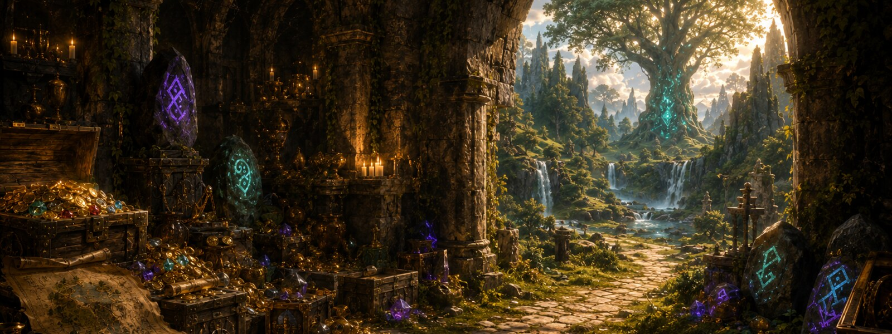
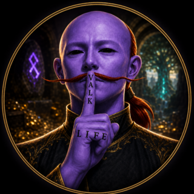

  

  

<h1 align="center">ValkLife</h1>

  <strong>Local-first, evidence-backed tools for Old School RuneScape.</strong>

  
  
  

## Ownership and leadership

<table>
  <tr>
    <td width="126" align="center">
      
    </td>
    <td>
      <strong>ValkLife — Founder &amp; Final Project Authority</strong> 
      Executive Product Owner · Creative Director · Project Governance &amp; Release Authority  
      I own and direct the ValkLife OSRS Bible project: its vision, production priorities, brand standards, acceptance criteria, community strategy, and final release authorization. Project agents and specialist workflows are accountable to this authority and operate only within approved scopes.
    </td>
  </tr>
</table>

| Responsibility | Decision authority |
| --- | --- |
| **Product direction** | Defines the user outcome, scope, and production order |
| **Production governance** | Approves quality, privacy, safety, and evidence standards |
| **Creative direction** | Owns the visual identity and public presentation |
| **Final acceptance** | Accepts or rejects completed work against explicit criteria |
| **Release authorization** | Makes the final decision to publish, install, or announce a release |

> [!IMPORTANT]
> ValkLife projects read and present information. They do **not** click, walk, attack, switch gear, activate prayers, consume items, bank, trade, or otherwise automate gameplay.

## What I am building

**ValkLife OSRS Bible** is a private, local-first RuneLite assistant and OSRS knowledge platform. It combines a read-only RuneLite plugin, a loopback bridge, revision-aware research, and deterministic planning tools.

The goal is straightforward: useful guidance should be grounded in current account context and traceable evidence—not guesswork.

## Project pillars

| Pillar | What it means |
| --- | --- |
| **Read-only by design** | Observe and explain without automating player actions |
| **Evidence before confidence** | Distinguish verified facts from unknown, unavailable, stale, or unreviewed information |
| **Local-first privacy** | Keep account context and private runtime data on the local machine |
| **Deterministic planning** | Make requirements, eligibility, costs, freshness, and blockers explicit |
| **Production discipline** | Validate lifecycle, concurrency, schemas, packaging, and release boundaries |

## Current work

- Building responsive RuneLite panels for chat, context, research, recovery, gear, prices, and goals
- Maintaining a revision-aware local OSRS knowledge corpus
- Improving evidence-backed retrieval and hallucination resistance
- Hardening the loopback bridge and account-context privacy boundary
- Verifying Java, Python, Swing, lifecycle, concurrency, and packaging behavior

## Technology

  
  
  
  
  

## Public showcase

A separate public showcase is being prepared for architecture highlights, screenshots, design principles, and release notes. The private production repository, local databases, credentials, account snapshots, and runtime configuration remain private.

---

  <strong>Observe clearly. Verify carefully. Automate nothing.</strong>

